```{r setup, include=FALSE}
knitr::opts_chunk$set(echo = TRUE)
```

# _Methodology_ {.tabset .tabset-fade .tabset-pills}

## Cross-Industry Standard Process for Data Mining (CRISP-DM)

Banyak hasil penelitian yang mengungkapkan bahwa CRISP-DM adalah datamining model yang masih digunakan secara luas di kalangan industry, sebahagian dikarenakan keunggulannya dalam menyelesaikan banyak persoalan dalam proyek proyek data mining. 

Mariscal, Marba dan Fernandez (Mariscal, Marban, and Fernandez 2010) menyatakan CRISP-DM sebagai defacto menjadi standar untuk pengembangan proyek data mining dan knowledge discovery karena paling banyak digunakan dalam pengembangan data mining. Hal tersebut dapat terlihat dari survei yang ditunjukkan pada gambar berikut yang dilakukan terhadap penggunaan metodologi dalam proyek data mining.

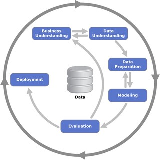

1. Business Understanding
  + Memahami proses data secara komprehensif
  
  Ini adalah tahap pertama dalam CRISP-DM dan termasuk bagian yang cukup vital. Pada tahap ini membutuhkan pengetahuan dari objek bisnis, bagaimana membangun atau mendapatkan data, dan bagaimana untuk mencocokan tujuan pemodelan untuk tujuan bisnis sehingga model terbaik dapat dibangun. Kegiatan yang dilakukan antara lain: menentukan tujuan dan persyaratan dengan jelas secara keseluruhan, menerjemahkan tujuan tersebut serta menentukan pembatasan dalam perumusan masalah data mining, dan selanjutnya mempersiapkan strategi awal untuk mencapai tujuan tersebut.
  
  
2. Data Understanding
  + Mendapatkan pemahaman awal mengenai data yang dibutuhkan untuk memecahkan permasalahan bisnis yang diberikan
  
Secara garis besar untuk memeriksa data, sehingga dapat mengidentifikasi masalah dalam data. Tahap ini memberikan fondasi analitik untuk sebuah penelitian dengan membuat ringkasaan (summary) dan mengidentifikasi potensi masalah dalam data. Tahap ini juga harus dilakukan secara cermat dan tidak terburu-buru, seperti pada visualisasi data, yang terkadang insight-nya sangat sulit didapat dika dihubungkan dengan summary data nya. Jika ada masalah pada tahap ini yang belum terjawab, maka akan menggangu pada tahap modeling.

Ringkasan atau summary dari data dapat berguna untuk mengkonfirmasi apakah data terdistribusi seperti yang diharapkan, atau mengungkapkan penyimpangan tak terduga yang perlu ditangani pada tahap selanjutnya, yaitu Data Preperation.

Masalah dalam data biasanya seperti nilai-nilai yang hilang, outlier, berdistribusi spike, berdistribusi bimodal harus diidentifikasi dan diukur sehingga dapat diperbaiki dalam Data Preperation.

3. Data Preparation
  + Proses pengumpulan, penggabungan, penataan, dan pengorganisasian data
  
Secara garis besar untuk memperbaiki masalah dalam data, kemudian membuat variabel derived. Tahap ini jelas membutuhkan pemikiran yang cukup matang dan usaha yang cukup tinggi untuk memastikan data tepat untuk algoritma yang digunakan.

Bukan berarti saat Data Preperation pertama kali dimana masalah-masalah pada data sudah diselesaikan, data sudah dapat digunakan hingga tahap terakhir. Tahap ini merupakan tahap yang sering ditinjau kembali saat menemukan masalah pada saat pembangunan model. Sehingga dilakukan iterasi sampai menemukan hal yang cocok dengan data.

Tahap sampling dapat dilakukan disini dan data secara umum dibagi menjadi dua, data training dan data testing.

Kegiatan yang dilakukan antara    lain: memilih kasus dan parameter yang akan dianalisis (Select Data), melakukan transformasi terhadap parameter tertentu (Transformation), dan melakukan pembersihan data agar data siap untuk tahap modeling (Cleaning).

4. Modelling
  + Membuat model prediktif atau deskriptif

Secara garis besar untuk membuat model prediktif atau deskriptif. Pada tahap ini dilakukan metode statistika dan Machine Learning untuk penentuan terhadap teknik data mining, alat bantu data mining, dan algoritma data mining yang akan diterapkan. Lalu selanjutnya adalah melakukan penerapan teknik dan algoritma data mining tersebut kepada data dengan bantuan alat bantu. Jika diperlukan penyesuaian data terhadap teknik data mining tertentu, dapat kembali ke tahap data preparation.

Beberapa modeling yang biasa dilakukan adalah classification, scoring, ranking, clustering, finding relation, dan characterization.


5. Evaluation
  + Melakukan interpretasi terhadap hasil dari data mining
  
Melakukan interpretasi terhadap hasil dari data mining yang dihasilkan dalam proses pemodelan pada tahap sebelumnya. Evaluasi dilakukan terhadap model yang diterapkan pada tahap sebelumnya dengan tujuan agar model yang ditentukan dapat sesuai dengan tujuan yang ingin dicapai dalam tahap pertama.

6. Deployment
  + Rencana penerapan atau penggunaan model

Tahap deployment atau rencana penggunaan model adalah tahap yang paling dihargai dari proses CRISP-DM. Perencanaan untuk Deployment dimulai selama Business Understanding dan harus menggabungkan tidak hanya bagaimana untuk menghasilkan nilai model, tetapi juga bagaimana mengkonversi skor keputusan, dan bagaimana untuk menggabungkan keputusan dalam sistem operasional.

# 1. Business Understanding {.tabset .tabset-fade .tabset-pills}
Memahami proses data secara komprehensif

Banyak orang berjuang untuk mendapatkan pinjaman karena sejarah kredit yang tidak mencukupi atau tidak ada. Dan, sayangnya, populasi ini sering dimanfaatkan oleh pemberi pinjaman yang tidak dapat dipercaya.

Home Credit berupaya untuk memperluas inklusi keuangan bagi populasi unbanked dengan memberikan pengalaman pinjaman yang positif dan aman. Untuk memastikan populasi yang kurang terlayani ini memiliki pengalaman pinjaman yang positif, Home Credit menggunakan berbagai data alternatif--termasuk telekomunikasi dan informasi transaksi--untuk memprediksi kemampuan pembayaran klien mereka.

Sementara Home Credit saat ini menggunakan berbagai metode statistik dan pembelajaran mesin untuk membuat prediksi ini, mereka menantang kami untuk membantu mereka membuka potensi penuh dari data mereka. Melakukannya akan memastikan bahwa **klien yang mampu membayar tidak ditolak dan pinjaman diberikan dengan pokok, jatuh tempo, dan kalender pembayaran yang akan memberdayakan klien mereka untuk menjadi sukses.**

Company wants to automate the loan eligibility process (real time) based on customer detail provided while filling online application form. These details are Gender, Marital Status, Education, Number of Dependents, Income, Loan Amount, Credit History and others. To automate this process, they have given a problem to identify the customers' segments, those are eligible for loan amount so that they can specifically Loan_Status these customers. Here they have provided a partial data set.

Perusahaan ingin mengotomatisasi proses kelayakan pinjaman (real time) berdasarkan detail pelanggan yang diberikan saat mengisi formulir aplikasi online. Rincian ini adalah Jenis Kelamin, Status Perkawinan, Pendidikan, Jumlah Tanggungan, Pendapatan, Jumlah Pinjaman, Riwayat Kredit dan lain-lain. Untuk mengotomatisasi proses ini, mereka telah memberikan masalah untuk mengidentifikasi segmen pelanggan, yang memenuhi syarat untuk jumlah pinjaman sehingga mereka dapat secara khusus Loan_Status pelanggan tersebut. Di sini mereka telah menyediakan kumpulan data parsial.

# 2. Data Understanding {.tabset .tabset-fade .tabset-pills}

Langkah selanjutnya adalah melihat data yang sedang kita kerjakan. Secara realistis, sebagian besar data yang akan kita dapatkan, bahkan dari pemerintah, dapat memiliki kesalahan, dan penting untuk mengidentifikasi kesalahan ini sebelum menghabiskan waktu untuk menganalisis data. Biasanya, kita harus menjawab pertanyaan-pertanyaan berikut:

o Do we find something wrong in the data?

o Are there ambiguous variables in the dataset?

o Are there variables that should be fixed or removed?

## Load Data and Library

```{r}
library(tidyverse)
library(ggplot2)
library(corrplot) 
library(corrgram)
library(ROCR)
library(psych)
library(reshape2)
library(VIM)
library(randomForest)
library(mlbench)
library(caret)
library(e1071)
library(AppliedPredictiveModeling)
library(imbalance)
library(dplyr)
library(naivebayes)
library(rpart)
library(RSNNS)
library(LogicReg)
library(kernlab)
library(rpart.plot)
library(openxlsx)
library(skimr)
library(ada)
```


```{r}
raw_data = read.csv(file="home_loan.csv", na.strings=c("", "NA"), header=TRUE) 
head(raw_data)
```
**Penggantian Nilai Aneh**
```{r}
library(plyr)
raw_data$Dependents <- revalue(raw_data$Dependents, c("3+"="3"))
```
**Simpan dataset ke dalam format DataFrame**

Dengan format DataFrame, kita dapat dengan mudah melakukan berbagai perintah dan modifikasi pada data untuk analisis lebih lanjut. Kita dapat menampilkan informasi tipe data dan jumlah baris non-null dari setiap atribut/variabel.


```{r}
mydata<-data.frame(raw_data[,-1])
str(mydata)
```

**Ubah semua kolom/atribut yang bertipe karakter menjadi faktor**

```{r}
str(mydata)
mydata <- as.data.frame(unclass(mydata), stringsAsFactors = TRUE)

mydata[, c('Gender','Married','Dependents','Education','Self_Employed','Property_Area','Loan_Status')] <- sapply(mydata[, c('Gender','Married','Dependents','Education','Self_Employed','Property_Area','Loan_Status')], unclass)

head(mydata)
skimmed <- skim_to_wide(mydata)
skimmed
```

## Statistika Deskriptif

Pada statistika deskriptif disajikan ringkasan data dengan memperhatikan bagaimana pola persebaran data, nilai minimum, maksimum, rata-rata, standar deviasi, dan apakah data hanya berkumpul dalam rentang kuartil tertentu yang nantinya penting bagi kita untuk melakukan langkah _preprocessing_ selanjutnya.

```{r}
skimmed <- skim_to_wide(mydata)
skimmed
```

## Visualisasi Data

Visualisasi data adalah proses membuat representasi visual dari data.

Visualisasi data merupakan alat yang ampuh untuk menjelajahi kumpulan data yang besar dan kompleks.

Memvisualisasikan data membantu pengguna untuk memahami pola, tren, hubungan, dan outlier yang tersembunyi di dalam data yang besar dan kompleks.

## Visualisasi Data Numerik

### Applicant Income

```{r}
hist(mydata$ApplicantIncome, 
     main="Histogram for Applicant Income", 
     xlab="Applicant Income", 
     border="blue", 
     col="maroon",
     las=1, 
     breaks=20, prob = TRUE)
boxplot(mydata$ApplicantIncome, col='maroon',xlab = 'Applicant Income', main = 'Box Plot for Applicant Income')
```

### Coapplicant Income
```{r}
hist(mydata$CoapplicantIncome, 
     main="Histogram for Coapplicant Income", 
     xlab="Coapplicant Income", 
     border="blue", 
     col="maroon",
     las=1, 
     breaks=50, prob = TRUE)
boxplot(mydata$CoapplicantIncome, col='maroon',xlab = 'CoapplicantIncome', main = 'Box Plot for Coapplicant Income')
```


### Loan Amount

```{r}
hist(mydata$LoanAmount, 
     main="Histogram for Loan Amount
", 
     xlab="Loan Amount", 
     border="blue", 
     col="maroon",
     las=1, 
     breaks=50, prob = TRUE)
boxplot(mydata$LoanAmount, col='maroon',xlab = 'LoanAmount', main = 'Box Plot for Applicant Income')
```

### Loan_Amount_Term
```{r}
hist(mydata$Loan_Amount_Term, 
     main="Histogram for Loan Amount Term
", 
     xlab="Income", 
     border="blue", 
     col="maroon",
     las=1, 
     breaks=50, prob = TRUE)
#lines(density(tr$ApplicantIncome), col='black', lwd=3)
boxplot(mydata$Loan_Amount_Term, col='maroon',xlab = 'Loan Amount Term', main = 'Box Plot for Loan Amount Term')
```

Di sini kita melihat bahwa ada beberapa nilai ekstrim di ketiga variabel. Mari kita periksa juga apakah distribusi jumlah pinjaman pemohon dipengaruhi oleh tingkat pendidikan mereka.

```{r}
library(ggplot2)
data(tr, package="lattice")
ggplot(data=mydata, aes(x=LoanAmount, fill=Education)) +
  geom_density() +
  facet_grid(Education~.)
```

Dapat terlihat bahwa lulusan memiliki lebih banyak outlier dan distribusi jumlah pinjaman mereka lebih luas.

## Visualisasi Data Kategorik

Sekarang mari kita lihat variabel kategori dalam dataset.

```{r}
counts <- table(mydata$Loan_Status, mydata$Gender)
barplot(counts, main="Loan Status by Gender",
        xlab="Gender", col=c("darkgrey","maroon"),
        legend = rownames(counts))
counts2 <- table(mydata$Loan_Status, mydata$Education)
barplot(counts2, main="Loan Status by Education",
        xlab="Education", col=c("darkgrey","maroon"),
        legend = rownames(counts2))
counts3 <- table(mydata$Loan_Status, mydata$Married)
barplot(counts3, main="Loan Status by Married",
        xlab="Married", col=c("darkgrey","maroon"),
        legend = rownames(counts3))
counts4 <- table(mydata$Loan_Status, mydata$Self_Employed)
barplot(counts4, main="Loan Status by Self Employed",
        xlab="Self_Employed", col=c("darkgrey","maroon"),
        legend = rownames(counts4))
counts5 <- table(mydata$Loan_Status, mydata$Property_Area)
barplot(counts5, main="Loan Status by Property_Area",
        xlab="Property_Area", col=c("darkgrey","maroon"),
        legend = rownames(counts5))
counts6 <- table(mydata$Loan_Status, mydata$Credit_History)
barplot(counts6, main="Loan Status by Credit_History",
        xlab="Credit_History", col=c("darkgrey","maroon"),
        legend = rownames(counts5))
```

## Imbalance Data Chech
Memeriksa apakah data kita _imbalance_ atau tidak

```{r}
createPlot<-function(loadedData){
ggplot(loadedData, aes(x = Loan_Status)) +
  geom_bar(aes(fill = "yellow")) +
  ggtitle("Loan Status") +
  theme(legend.position="none")
}

createPlot(mydata)
```

## _Imputation Missing Values_

Memeriksa data yang hilang
```{r}
sapply(mydata,function(x) sum(is.na(x)))
```
```{r}
mydata$CoapplicantIncome[is.na(mydata$CoapplicantIncome)] <- mean(mydata$CoapplicantIncome, na.rm = TRUE)
```


Imputasi dengan metode KNN
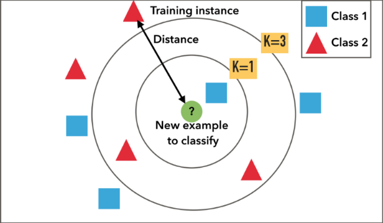
```{r}
set.seed(125)
mydata
thisdata = kNN(mydata, k=5, imp_var = FALSE)
sapply(thisdata,function(x) sum(is.na(x)))
```


## Treat Extreme Values
Saatnya memperlakukan nilai-nilai ekstrem. Misalnya pada variabel LoanAmount, dapat diduga bahwa nilai ekstrim dimungkinkan karena beberapa pelanggan, untuk beberapa alasan, mungkin ingin mengajukan jumlah pinjaman yang lebih tinggi. Kami akan melakukan transformasi log untuk menormalkan data:
### Applicant Income
```{r}
thisdata$ApplicantIncome = log(thisdata$ApplicantIncome)
hist(thisdata$ApplicantIncome, 
     main="Histogram for Applicant Income", 
     xlab="Applicant Income", 
     border="blue", 
     col="maroon",
     las=1, 
     breaks=20, prob = TRUE)
lines(density(thisdata$ApplicantIncome), col='black', lwd=3)
```
### Coapplicant Income

```{r}
thisdata$CoapplicantIncome <- log(thisdata$CoapplicantIncome+1)
hist(thisdata$CoapplicantIncome, 
     main="Histogram for Coapplicant Income", 
     xlab="Coapplicant Income", 
     border="blue", 
     col="maroon",
     las=1, 
     breaks=20, prob = TRUE)
lines(density(thisdata$CoapplicantIncome), col='black', lwd=3)
```

### Loan Amount
```{r}
thisdata$LoanAmount <- log(thisdata$LoanAmount)
hist(thisdata$LoanAmount, 
     main="Histogram for Loan Amount", 
     xlab="Loan Amount", 
     border="blue", 
     col="maroon",
     las=1, 
     breaks=20, prob = TRUE)
lines(density(thisdata$LoanAmount), col='black', lwd=3)
```
### Loan Amount Term
```{r}
thisdata$Loan_Amount_Term <- log(thisdata$Loan_Amount_Term)
hist(thisdata$Loan_Amount_Term, 
     main="Histogram for Loan Amount Term", 
     xlab="Loan Amount Term", 
     border="blue", 
     col="maroon",
     las=1, 
     breaks=20, prob = TRUE)
lines(density(thisdata$Loan_Amount_Term), col='black', lwd=3)
```


## Analisis Korelasi

Periksa korelasi antar fitur.
```{r}
cordata <- data.matrix(thisdata)
cormat <- round(cor(cordata, method = "pearson"),2)
melted_cormat <- melt(cormat)


# Peroleh segitiga bawah dari matriks korelasi
  get_lower_tri<-function(cormat){
    cormat[upper.tri(cormat)] <- NA
    return(cormat)
  }
# Peroleh segitiga atas dari matriks korelasi
  get_upper_tri <- function(cormat){
    cormat[lower.tri(cormat)]<- NA
    return(cormat)
  }

upper_tri <- get_upper_tri(cormat)
# Atur matriks korelasi
melted_cormat <- melt(upper_tri, na.rm = TRUE)
# Buat ggheatmap
ggheatmap <- ggplot(melted_cormat, aes(Var2, Var1, fill = value))+
 geom_tile(color = "white")+
 scale_fill_gradient2(low = "blue", high = "red", mid = "white",
   midpoint = 0, limit = c(-1,1), space = "Lab",
    name="Pearson\nCorrelation") +
  theme_minimal()+ # minimal theme
 theme(axis.text.x = element_text(angle = 45, vjust = 1,
    size = 9, hjust = 1))+
 coord_fixed()

ggheatmap +
geom_text(aes(Var2, Var1, label = value), color = "black", size = 2) +
theme(
  axis.title.x = element_blank(),
  axis.title.y = element_blank(),
  panel.grid.major = element_blank(),
  panel.border = element_blank(),
  panel.background = element_blank(),
  axis.ticks = element_blank(),
  legend.justification = c(1, 0),
  legend.position = c(0.6, 0.7),
  legend.direction = "horizontal")+
  guides(fill = guide_colorbar(barwidth = 7, barheight = 1,
                title.position = "top", title.hjust = 0.5))
```

# 3. Data Preparation

## Cek Imbalance

Imbalance data atau data tidak berimbang merupakan kondisi dimana salah satu atau lebih dari class yang ada dalam suatu himpunan memiliki jumlah yang cukup timpang atau memliki perbedaan yang cukup jauh diantara class yang ada. Contoh nya misalkan pada suatu himpunan data yang terdiri dari dua kelas memiliki perbandingan rasio 1:100 atau 1:1000 dan seterusnya. Kondisi tersebut menyebabkan imbalance data yang dampaknya menyebabkan hasil analisis bias dan tidak optimal.

Distribusi class atau kategori dan rasio imbalance dari data asli
```{r}
plotImbalance<-function(data){
#  abbrev_x <- c("","No","","Yes","")
  ggplot(data, aes(x = Loan_Status)) +
    geom_bar(aes(fill = "blue")) +
#    scale_x_continuous(breaks = seq(0.5,2.5,by=0.5), labels = abbrev_x) + 
    ggtitle("Loan Status") +
    theme(legend.position="none")
}
plotImbalance(thisdata)
```
Masalah dengan melatih model dengan dataset yang tidak seimbang adalah model akan bias terhadap kelas mayoritas saja. Hal ini menyebabkan masalah ketika kita tertarik pada prediksi kelas minoritas (masalah dataset loan status 'No' dianggap lebih penting daripada loan status 'Yes').

```{r}
imbalanceRatio(thisdata, classAttr = "Loan_Status")
```

### Resampling

Kita akan membandingkan beberapa algoritma resampling untuk menyeimbangkan distribusi data kita.

### Synthetic Minority Over-sampling Technique (SMOTE)
Metode Synthetic Minority Over-sampling Technique (SMOTE) merupakan metode yang populer diterapkan dalam rangka menangani ketidak seimbangan kelas. Teknik ini mensintesis sampel baru dari kelas minoritas untuk menyeimbangkan dataset dengan cara sampling ulang sampel kelas minoritas.
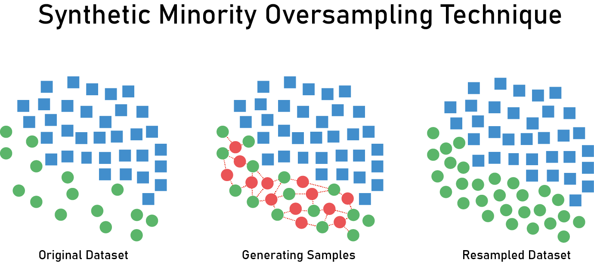
```{r}
set.seed(345)
dataSMOTE <- oversample(thisdata, ratio = 0.8, method = "SMOTE", classAttr = "Loan_Status")
plotImbalance(dataSMOTE)
```
```{r}
imbalanceRatio(dataSMOTE, classAttr = "Loan_Status")
```
### Adaptive Synthetic (ADASYN)

ADASYN (Adaptive Synthetic) adalah algoritme yang menghasilkan data sintetis, dan keuntungan terbesarnya adalah tidak menyalin data minoritas yang sama, dan menghasilkan lebih banyak data untuk contoh yang "lebih sulit dipelajari". 

Lebih lanjut: https://medium.com/@ruinian/an-introduction-to-adasyn-with-code-1383a5ece7aa

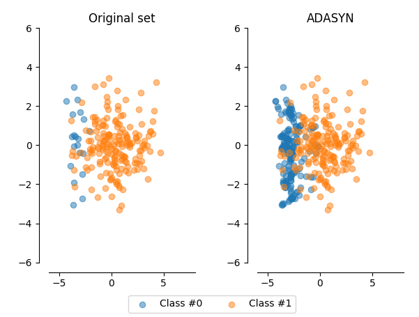

```{r}
set.seed(123)
dataADASYN <- oversample(thisdata, method = "ADASYN", classAttr = "Loan_Status")
plotImbalance(dataADASYN)
```
```{r}
imbalanceRatio(dataADASYN, classAttr = "Loan_Status")
```

### Majority-Weighted Minority Over-sampling Technique (MWMOTE)
MWMOTE merupakan metode yang men-generate data sintetis berdasarkan anggota cluster kelas minoritas yang berdekatan dengan kelas mayoritas. Metode ini dapat menangani overfitting dengan men-generate data sintetis secara baik dan mampu menghindari data sintetis yang dihasilkan menjadi data noise.
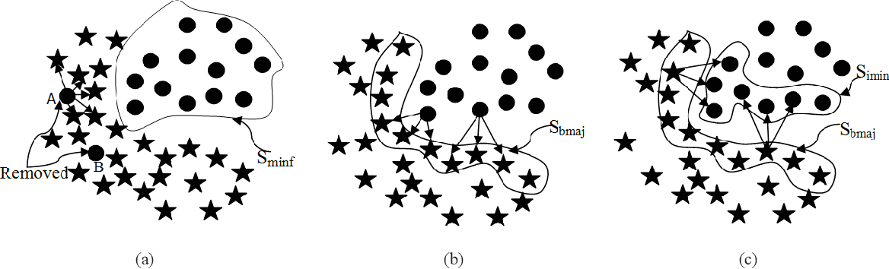
```{r}
set.seed(123)
dataMWMOTE <- oversample(thisdata, ratio = 0.95, method = "MWMOTE", classAttr = "Loan_Status")
plotImbalance(dataMWMOTE)
```
```{r}
imbalanceRatio(dataMWMOTE, classAttr = "Loan_Status")
```


### Feature Selection

```{r}
library(randomForest)
fit=randomForest(Loan_Status ~ . , data= dataADASYN)
varImpPlot(fit,type=2)
```

```{r}
dataset = dataMWMOTE
dataset2 = dataMWMOTE[,c('Loan_Status','Credit_History','ApplicantIncome','LoanAmount','CoapplicantIncome')]
```

# 4.1 Modelling {.tabset .tabset-fade .tabset-pills}

Pada 4.1 ini kita akan gunakan seluruh data, tanpa mempertimbangkan hasil seleksi fitur

Kita akan menggunakan _k-fold cross validation_
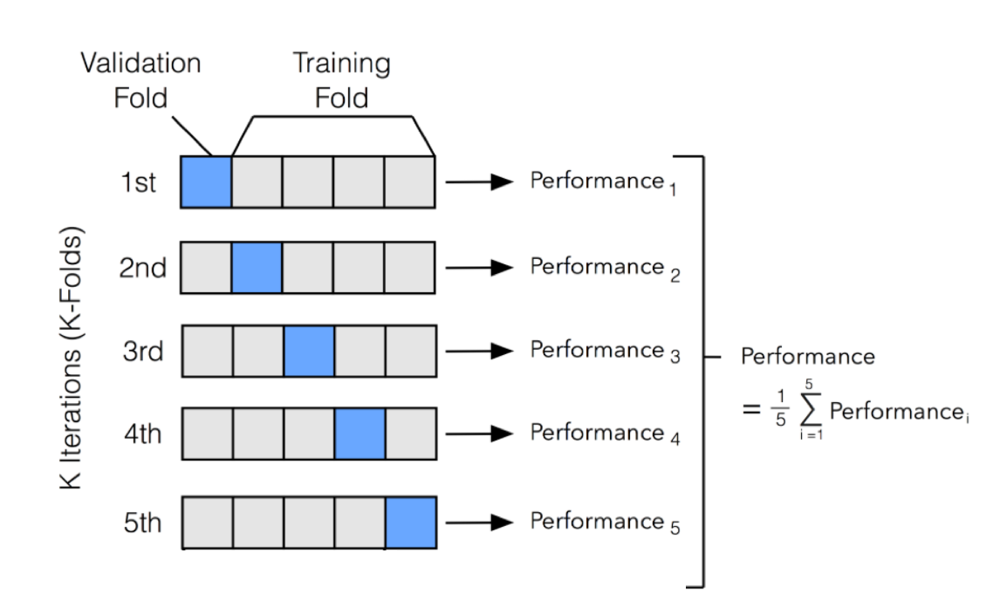
```{r}
# Set seed untuk menghasilkan keacakan yang sama
set.seed(123)

# Tentukan cross validation berulang dengan 10 folds/lipatan dan satu pengulangan
evaluationSetting <- trainControl(method='repeatedcv', 
                                  number=10, 
                                  repeats=1,
                                  # Evaluate performance using
                                  # the following function summaryFunction 
                                  summaryFunction = multiClassSummary)

metric <- "Accuracy"
```
## Decision Tree
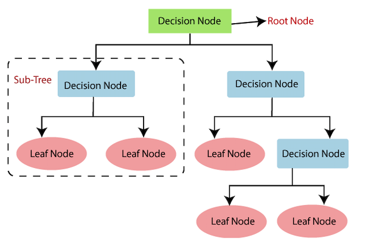


Classification and Regression Tree (CART)

```{r}
DT_Model <- caret::train(factor(Loan_Status)~.,
                    data=dataset,
                    method="rpart",
                    # metric=metric,
                    # tuneGrid = expand.grid(cp = seq(0, 0.1, 0.001)),
                    # parms = list(split='information'),
                    trControl=evaluationSetting)
print(DT_Model)
```

## Logistic Regression

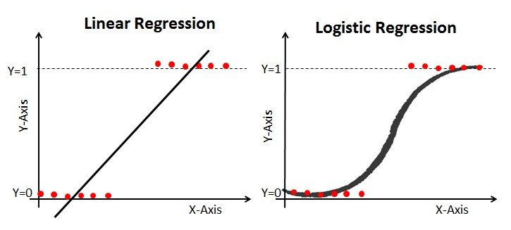


```{r}
RegLog_Model <- caret::train(factor(Loan_Status)~.,
                    data=dataset,
                    method="glm",
                    family = 'binomial',
                    # metric=metric,
                    trControl=evaluationSetting)
print(RegLog_Model)
```

## Support Vector Machine (SVM)
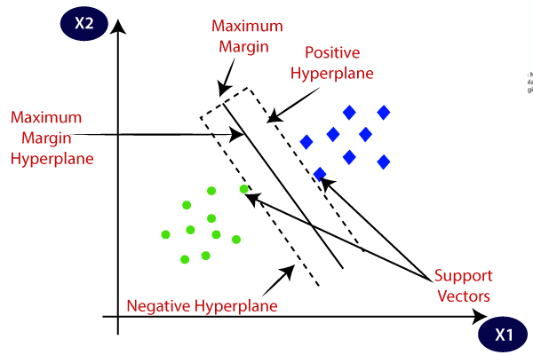


```{r}
SVM_Model <- caret::train(factor(Loan_Status)~.,
                    data=dataset,
                    method="svmRadial",
                    # metric=metric,
                    trControl=evaluationSetting)
print(SVM_Model)
```

## Naive Bayes

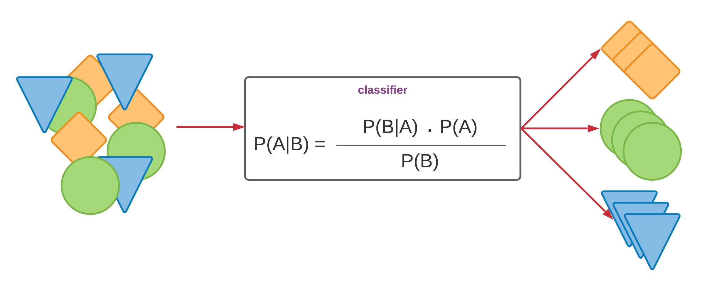

```{r}
NB_Model <- caret::train(factor(Loan_Status)~.,
                    data=dataset,
                    method="naive_bayes",
                    # metric=metric,
                    trControl=evaluationSetting)
print(NB_Model)
```
## Support Vector Machine (SVM)


```{r}
SVM_Model <- caret::train(factor(Loan_Status)~.,
                    data=dataset,
                    method="svmRadial",
                    # metric=metric,
                    trControl=evaluationSetting)
print(SVM_Model)
```

## Naive Bayes

```{r}
NB_Model <- caret::train(factor(Loan_Status)~.,
                    data=dataset,
                    method="naive_bayes",
                    # metric=metric,
                    trControl=evaluationSetting)
print(NB_Model)
```
## Neural Networks (NN)
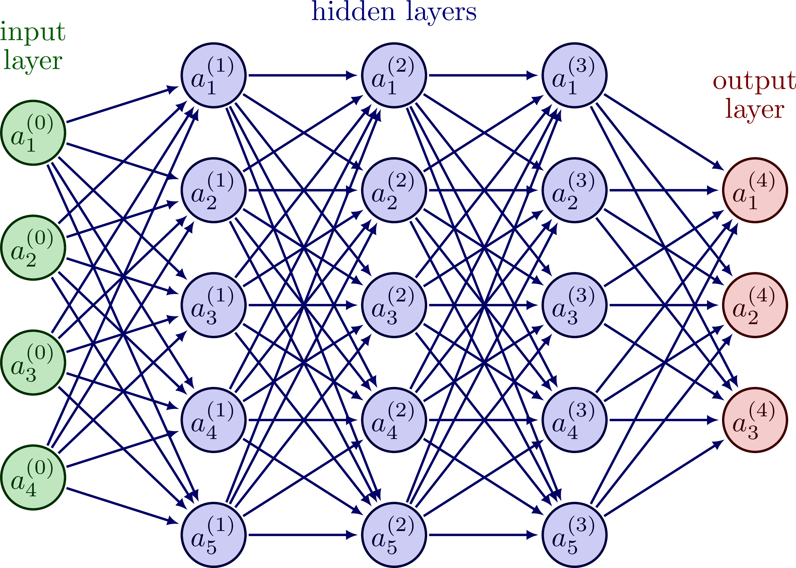

```{r}
NN_Model <- caret::train(factor(Loan_Status)~.,
                    data=dataset,
                    method="mlp",
                    tuneGrid = expand.grid(size = 1:10),
                    linOut = T,
                    metric=metric,
                    trControl=evaluationSetting)
print(NN_Model)
```

## Random Forest
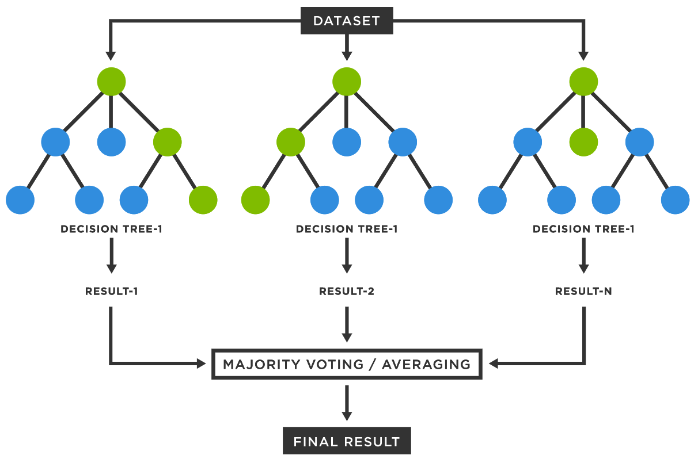
```{r}
RF_Model <- caret::train(factor(Loan_Status)~.,
                    data=dataset,
                    method="rf",
                    metric=metric,
                    tuneGrid=expand.grid(.mtry= 7),
                    trControl=evaluationSetting,
                    ntree = 300)
print(RF_Model)
```

## ADABoost

An AdaBoost classifier is a meta-estimator that begins by fitting a classifier on the original dataset and then fits additional copies of the classifier on the same dataset but where the weights of incorrectly classified instances are adjusted such that subsequent classifiers focus more on difficult cases.
```{r}
ADA_Model <- caret::train(factor(Loan_Status)~.,
                    data=dataset,
                    method="ada",
                    metric=metric,
                    trControl=evaluationSetting,
                    verbose=FALSE)
print(ADA_Model) 
```

## Gradient Boosting
Gradient boosting is a machine learning technique used in regression and classification tasks, among others. It gives a prediction model in the form of an ensemble of weak prediction models, which are typically decision trees.[1][2] When a decision tree is the weak learner, the resulting algorithm is called gradient-boosted trees; it usually outperforms random forest.[1][2][3] A gradient-boosted trees model is built in a stage-wise fashion as in other boosting methods, but it generalizes the other methods by allowing optimization of an arbitrary differentiable loss function.

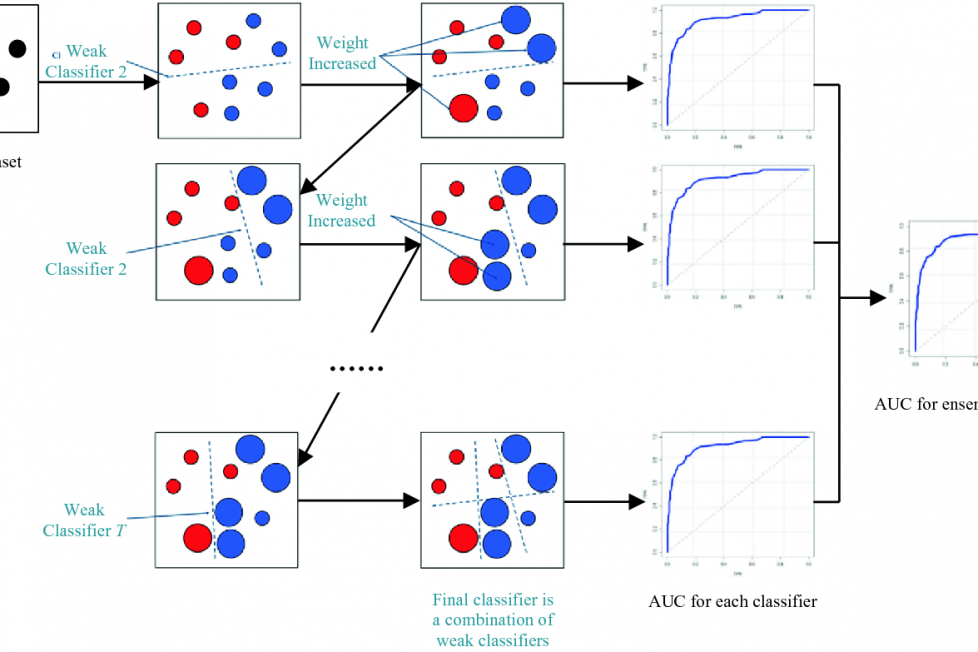
```{r}
GBM_Model <- caret::train(factor(Loan_Status)~.,
                    data=dataset,
                    method="gbm",
                    metric=metric,
                    #tuneGrid=expand.grid(.mtry= 7),
                    trControl=evaluationSetting,
                    verbose=FALSE)
print(GBM_Model)   
```

## LogitBoost
LogitBoost is a boosting classification algorithm. LogitBoost and AdaBoost are close to each other in the sense that both perform an additive logistic regression. The difference is that AdaBoost minimizes the exponential loss, whereas LogitBoost minimizes the logistic loss.
```{r}
LB_Model <- caret::train(factor(Loan_Status)~.,
                    data=dataset,
                    method="LogitBoost",
                    metric=metric,
                    trControl=evaluationSetting,
                    verbose=FALSE)
print(LB_Model)
```

```{r}
# Bandingkan kinerja model menggunakan resample()
models_compare <- resamples(list(DecisionTree = DT_Model, 
                                 LogisticRegression = RegLog_Model, 
                                 SupportVectorMachine = SVM_Model,
                                 NaiveBayes = NB_Model,
                                 NeuralNetworks = NN_Model,
                                 RandomForest = RF_Model,
                                 ADABoost = ADA_Model,
                                 GradienBoosting = GBM_Model,
                                 LogitBoost = LB_Model
                                 ))

# Ringkasan models performances
summary(models_compare)
```
# 4.2 Modelling {.tabset .tabset-fade .tabset-pills}

Pada 4.2 ini kita hanya akan menggunakan 5 fitur dengan importance score tertinggi.

## Decision Tree


Classification and Regression Tree (CART)

```{r}
DT_Model2 <- caret::train(factor(Loan_Status)~.,
                    data=dataset2,
                    method="rpart",
                    # metric=metric,
                    # tuneGrid = expand.grid(cp = seq(0, 0.1, 0.001)),
                    # parms = list(split='information'),
                    trControl=evaluationSetting)
print(DT_Model2)
```

## Logistic Regression


```{r}
RegLog_Model2 <- caret::train(factor(Loan_Status)~.,
                    data=dataset2,
                    method="glm",
                    family = 'binomial',
                    # metric=metric,
                    trControl=evaluationSetting)
print(RegLog_Model2)
```

## Support Vector Machine (SVM)

```{r}
SVM_Model2 <- caret::train(factor(Loan_Status)~.,
                    data=dataset2,
                    method="svmRadial",
                    # metric=metric,
                    trControl=evaluationSetting)
print(SVM_Model2)
```

## Naive Bayes


```{r}
NB_Model2 <- caret::train(factor(Loan_Status)~.,
                    data=dataset2,
                    method="naive_bayes",
                    # metric=metric,
                    trControl=evaluationSetting)
print(NB_Model2)
```
## Support Vector Machine (SVM)


```{r}
SVM_Model2 <- caret::train(factor(Loan_Status)~.,
                    data=dataset2,
                    method="svmRadial",
                    # metric=metric,
                    trControl=evaluationSetting)
print(SVM_Model2)
```

## Naive Bayes

```{r}
NB_Model2 <- caret::train(factor(Loan_Status)~.,
                    data=dataset2,
                    method="naive_bayes",
                    # metric=metric,
                    trControl=evaluationSetting)
print(NB_Model2)
```
## Neural Networks (NN)


```{r}
NN_Model2 <- caret::train(factor(Loan_Status)~.,
                    data=dataset2,
                    method="mlp",
                    tuneGrid = expand.grid(size = 1:10),
                    linOut = T,
                    metric=metric,
                    trControl=evaluationSetting)
print(NN_Model2)
```

## Random Forest

```{r}
RF_Model2 <- caret::train(factor(Loan_Status)~.,
                    data=dataset2,
                    method="rf",
                    metric=metric,
                    tuneGrid=expand.grid(.mtry= 7),
                    trControl=evaluationSetting,
                    ntree = 300)
print(RF_Model2)
```

## ADABoost

An AdaBoost classifier is a meta-estimator that begins by fitting a classifier on the original dataset and then fits additional copies of the classifier on the same dataset but where the weights of incorrectly classified instances are adjusted such that subsequent classifiers focus more on difficult cases.
```{r}
ADA_Model2 <- caret::train(factor(Loan_Status)~.,
                    data=dataset2,
                    method="ada",
                    metric=metric,
                    trControl=evaluationSetting,
                    verbose=FALSE)
print(ADA_Model2) 
```

## Gradient Boosting
Gradient boosting is a machine learning technique used in regression and classification tasks, among others. It gives a prediction model in the form of an ensemble of weak prediction models, which are typically decision trees.[1][2] When a decision tree is the weak learner, the resulting algorithm is called gradient-boosted trees; it usually outperforms random forest.[1][2][3] A gradient-boosted trees model is built in a stage-wise fashion as in other boosting methods, but it generalizes the other methods by allowing optimization of an arbitrary differentiable loss function.


```{r}
GBM_Model2 <- caret::train(factor(Loan_Status)~.,
                    data=dataset2,
                    method="gbm",
                    metric=metric,
                    #tuneGrid=expand.grid(.mtry= 7),
                    trControl=evaluationSetting,
                    verbose=FALSE)
print(GBM_Model2)   
```

## LogitBoost
LogitBoost is a boosting classification algorithm. LogitBoost and AdaBoost are close to each other in the sense that both perform an additive logistic regression. The difference is that AdaBoost minimizes the exponential loss, whereas LogitBoost minimizes the logistic loss.
```{r}
LB_Model2 <- caret::train(factor(Loan_Status)~.,
                    data=dataset2,
                    method="LogitBoost",
                    metric=metric,
                    trControl=evaluationSetting,
                    verbose=FALSE)
print(LB_Model2)
```

```{r}
# Bandingkan kinerja model menggunakan resample()
models_compare2 <- resamples(list(DecisionTree2 = DT_Model2, 
                                 LogisticRegression2 = RegLog_Model2, 
                                 SupportVectorMachine2 = SVM_Model2,
                                 NaiveBayes2 = NB_Model2,
                                 NeuralNetworks2 = NN_Model2,
                                 RandomForest2 = RF_Model2,
                                 ADABoost2 = ADA_Model2,
                                 GradienBoosting2 = GBM_Model2,
                                 LogitBoost2 = LB_Model2
                                 ))

# Ringkasan models performances
summary(models_compare2)
```

# 5. Evaluasi
```{r}
models_compares <- resamples(list(DecisionTree = DT_Model,
                                  DecisionTree2 = DT_Model2, 
                                 LogisticRegression = RegLog_Model,
                                 LogisticRegression2 = RegLog_Model2,
                                 SupportVectorMachine = SVM_Model,
                                 SupportVectorMachine2 = SVM_Model2,
                                 NaiveBayes = NB_Model,
                                 NaiveBayes2 = NB_Model2,
                                 NeuralNetworks = NN_Model,
                                 NeuralNetworks2 = NN_Model2,
                                 RandomForest = RF_Model,
                                 RandomForest2 = RF_Model2,
                                 ADABoost = ADA_Model,
                                 ADABoost2 = ADA_Model2,
                                 GradienBoosting = GBM_Model,
                                 GradienBoosting2 = GBM_Model2,
                                 LogitBoost = LB_Model,
                                 LogitBoost2 = LB_Model2
                                 ))

# Ringkasan models performances
summary(models_compares)
```


