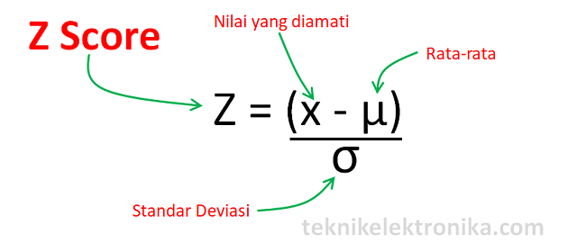
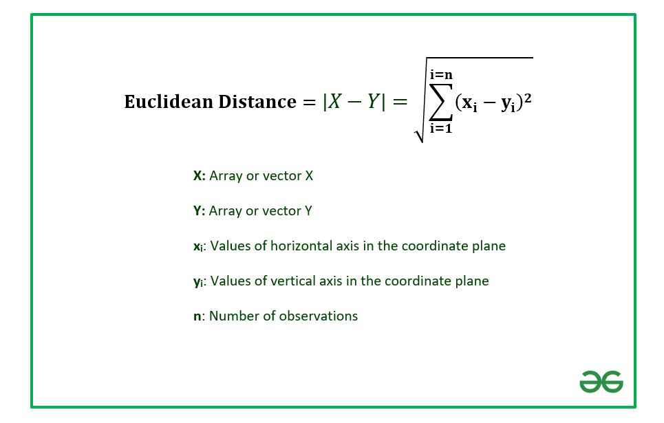
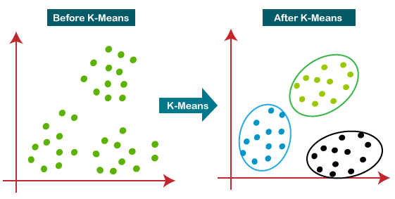
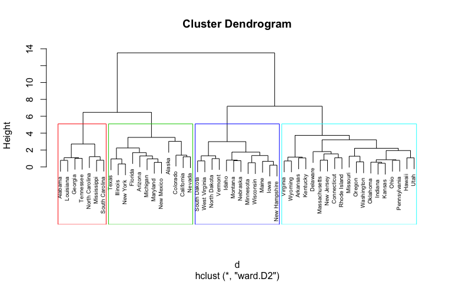

```{r setup, include=FALSE}
knitr::opts_chunk$set(echo = TRUE)
```

# 1. _Methodology_ {.tabset .tabset-fade .tabset-pills}

## Machine Learning Sebagai Solusi Klasterisasi Nasabah Kredit

Permasalahan seputar nasabah kredit merupakan isu yang kompleks dan sering dihadapi oleh lembaga keuangan. Beberapa permasalahan yang umum dihadapi meliputi:

Risiko Kredit: Menentukan tingkat risiko kredit nasabah untuk meminimalisir kerugian akibat gagal bayar.

Klasifikasi Nasabah: Mengelompokkan nasabah berdasarkan karakteristik dan perilaku mereka untuk menentukan strategi pemasaran dan layanan yang tepat.

Deteksi Penipuan: Mengidentifikasi pola transaksi yang mencurigakan untuk mencegah penipuan dan melindungi aset lembaga keuangan.


## Manfaat Machine Learning:
Algoritma clustering merupakan teknik pembelajaran mesin yang dapat membantu menyelesaikan permasalahan nasabah kredit dengan mengelompokkan data ke dalam beberapa cluster berdasarkan kesamaan ciri. Berikut adalah beberapa implementasi algoritma clustering dalam konteks nasabah kredit:

1. Segmentasi Nasabah:

Tujuan: Mengelompokkan nasabah berdasarkan karakteristik demografis, perilaku transaksi, dan riwayat kredit.

Manfaat: Membantu lembaga keuangan untuk:
Menentukan strategi pemasaran yang lebih efektif dan tertarget.
Menyediakan layanan yang lebih personal dan relevan dengan kebutuhan setiap segmen.
Mengoptimalkan alokasi sumber daya.

2. Deteksi Risiko Kredit:

Tujuan: Mengidentifikasi nasabah dengan risiko kredit tinggi berdasarkan riwayat pembayaran, skor kredit, dan faktor lainnya.

Manfaat: Membantu lembaga keuangan untuk:
Mengatur batas kredit dan persyaratan pinjaman yang lebih sesuai dengan profil risiko nasabah.
Mengalokasikan sumber daya untuk memantau nasabah dengan risiko tinggi lebih ketat.
Mengurangi kerugian akibat gagal bayar.

3. Deteksi Penipuan:

Tujuan: Mengidentifikasi pola transaksi yang mencurigakan berdasarkan waktu, lokasi, dan jumlah transaksi.

Manfaat: Membantu lembaga keuangan untuk:
Mencegah penipuan dan melindungi aset lembaga keuangan.
Meningkatkan efisiensi proses verifikasi dan persetujuan transaksi.

Contoh Implementasi:

Misalnya, lembaga keuangan dapat menggunakan algoritma K-Means untuk mengelompokkan nasabah berdasarkan skor kredit mereka. Nasabah dengan skor kredit tinggi akan dikelompokkan ke dalam cluster "risiko rendah", sementara nasabah dengan skor kredit rendah akan dikelompokkan ke dalam cluster "risiko tinggi". Informasi ini dapat digunakan untuk menentukan strategi pemasaran yang lebih tertarget atau untuk menentukan batas kredit yang lebih sesuai dengan profil risiko nasabah.


# 2. Data Understanding {.tabset .tabset-fade .tabset-pills}

Dataset yang digunakan dalam kasus ini terdapat 1000 baris dan 9 kolom, dimana terdapat 9 atribut.

age = umur (Numberic : 19-75 tahun)

sex = gender/jenis kelamin (Text : Female, Male)

job = tingkat pekerjaan (Numberic : 0, 1, 2, 3)

housing = status tinggal (Text : Own, Free, Rent)

saving accounts = uang tabungan (Text : Little, Quite Rich, Rich, 
Moderate)

checking account = tabungan giro (Text : Little, Moderate, Rich)

credit amount = jumlah kredit (Numberic : 250-18424)

duration = durasi (Numberic : 4-72 bulan)

purpose = tujuan (Text : Radio/TV, Education, Furniture/equipment, car, business)

## Load Data and Library

```{r}
library(tidyverse)  # data manipulation
library(cluster)    # clustering algorithms
library(factoextra) # clustering algorithms & visualization
library(PerformanceAnalytics)
library(ggpubr)
library(tibble)
library(MVN)
library(ggdendro)
```


```{r}
data=read.csv('credit.csv',header=TRUE)
# mengambil variabel numerik
data <- data[,c(1,7,8)]
head(data)
```
Pada analisis kluster ini, kita hanya gunakan data dengan format numerik saja, karena algoritma klustering tidak bisa bekerja dengan data kategorik.

## Statistika Deskriptif

Pada statistika deskriptif disajikan ringkasan data dengan memperhatikan bagaimana pola persebaran data, nilai minimum, maksimum, rata-rata, standar deviasi, dan apakah data hanya berkumpul dalam rentang kuartil tertentu yang nantinya penting bagi kita untuk melakukan langkah _preprocessing_ selanjutnya.

```{r}
summary(data)
```
Dari hasil ini terlihat bahwa umur nasabah kredit termuda adalah 19 tahun dan umur tertua adalah 75 tahun dengan rata-rata umur nasabah adalah 35.55 tahun. Kemudian jumlah kredit yang dimiliki oleh nasabah berkisar 250 USD hingga 18424 USD dan rata-ratanya adalah 3271 USD. Terakhir, durasi kredit dari para nasabah berkisar antara 4 hingga 72 bulan dengan rata-rata 21 bulan.

## Visualisasi Data

Visualisasi data adalah proses membuat representasi visual dari data.

Visualisasi data merupakan alat yang ampuh untuk menjelajahi kumpulan data yang besar dan kompleks.

Memvisualisasikan data membantu pengguna untuk memahami pola, tren, hubungan, dan outlier yang tersembunyi di dalam data yang besar dan kompleks.

### Age
```{r}
hist(data$Age, 
     main="Histogram for Age", 
     xlab="Age", 
     border="blue", 
     col="maroon",
     las=1, 
     breaks=20, prob = TRUE)
```

### Credit Amount
```{r}
hist(data$Credit.amount, 
     main="Histogram for Credit Amount", 
     xlab="Credit Amount", 
     border="blue", 
     col="maroon",
     las=1, 
     breaks=50, prob = TRUE)
```

### Duration
```{r}
hist(data$Duration, 
     main="Histogram for Duration", 
     xlab="Duration", 
     border="blue", 
     col="maroon",
     las=1, 
     breaks=50, prob = TRUE)
```

## _Missing Values Check_

Memeriksa data yang hilang
```{r}
sapply(data,function(x) sum(is.na(x)))
```
Dari hasil ini, terlihat bahwa tidak ada _Missing Values_ atau data kosong yang ada di dalam dataset yang kita gunakan. Hal ini menunjukkan bahwa dataset sudah cukup baik untuk digunakan dalam pemodelan.

# 3. Clustering {.tabset .tabset-fade .tabset-pills}
Pada bagian 3 ini kita akan lakukan klusterisasi menggunakan kMeans dan juga Hierarchical Clustering.

## Standardize Data
Mula-mula, kita standarisasi terlebih dahulu data yang akan kita gunakan. Proses standarisasi ini berguna agar data tidak memiliki variasi nilai yang begitu besar sehingga mempermudah model dalam membuat kluster-klusternya.

```{r}
data_standar <- scale(data)
```


Kemudian kita hitung jaraknya menggunakan jarak Euclidean

```{r}
jarak <- dist(data_standar)
```

## Optimal Number of Cluster
Sebelum memulai klusterisasi, terlebih dahulu kita harus menentukan jumlah kluster optimal dari data yang kita gunakan. Untuk ini kita dapat menggunakan metode Elbow maupun Silhouette.
```{r}
# Elbow and Silhouette
set.seed(100)
fviz_nbclust(data_standar, kmeans, method = "wss")
fviz_nbclust(data_standar, kmeans, method='silhouette')
```
Dari hasil kedua metode, kita bisa lihat bahwa jumlah kluster optimal dari data yang kita miliki adalah 2.

## k-Means Clustering


```{r}
set.seed(100)
kMean <- kmeans(data_standar, centers = 2)
fviz_cluster(kMean, data = data_standar)
```
Dari hasil ini, kita dapat lihat bahwa mayoritas data berkumpul di kluster 1. Akibatnya kluster 1 memiliki data-data dengan rata-rata yang tidak jauh berbeda sehingga rata-rata dari kluster bisa menggambarkan rata-rata dari seluruh data pada kluster tersebut dengan baik.


Setelah itu kita gabungkan kluster yang sudah didapat dengan data awal
```{r}
df.cluster = data.frame(data, kMean$cluster)
df.cluster
```
Terakhir, kita _grouping_ atau kelompokkan data-data yang kita punya ke dalam kluster-klusternya.
```{r}
df.cluster %>%
  group_by(kMean.cluster) %>%
  summarize_all(list(mean = mean, min = min, max = max))
```

Menurut hasil klusterisasi dengan k-Means Clustering, dapat dilihat bahwa kluster 1 punya rata-rata nasabah dengan usia 35.6 tahun dengan rata-rata jumlah kredit sebesar 2149 USD dengan durasi rata-rata selama 16 bulan. Sedangkan kluster 2 berisi nasabah dengan rata-rata usia sebesar 35 tahun dengan jumlah kredit rata-ratanya adalah 7249 USD dengan durasi 37 bulan.

## Hierarchical Clustering



Dalam metode klusterisasi menggunakan Hierarchical Clustering, pertama-tama kita tentukan mana model yang paling stabil terhadap data yang digunakan.
```{r}
hc_complete = hclust(dist(data_standar), method = "complete")
hc_average = hclust(dist(data_standar), method = "average")
hc_single = hclust(dist(data_standar), method = "single")
```

Untuk melihat stabilitasnya, kita bisa lihat pada dendogram di bawah ini
```{r}
ggdendrogram(hc_complete, rotate = FALSE, size = 2) + labs(title = "Complete Linkage") 
ggdendrogram(hc_average, rotate = FALSE, size = 2) + labs(title = "Average Linkage")
ggdendrogram(hc_single, rotate = FALSE, size = 2) + labs(title = "Single Linkage")
```
Dari hasil di atas, terlihat bahwa dendogram paling stabil adalah milik Complete, sehingga kita pilih model ini sebagai model klusterisasi. Selain itu, kita juga gunakan jumlah kluster optimal yang sudah kita dapat sebelumnya.
```{r}
cut_point = cutree(hc_complete, k = 2) #Memilih sebanyak 2 klaster
```

Setelah dilakukan klusterisasi dengan jumlah kluster optimal, kita lihat pengelompokkan berdasarkan setiap klusternya.
```{r}
data %>%
  mutate(Klaster = cut_point) %>%
  group_by(Klaster) %>%
  summarize_all(list(mean = mean, min = min, max = max))
```
Dari hasil di atas, terlihat bahwa menurut Hierarchical Clustering, kluster 1 berisi nasabah dengan rata-rata umur 35 tahun dengan rata-rata jumlah kredit sebesar 2497 USD dengan rata-rata durasi selama 17 bulan. Sedangkan kluster 2 berisi nasabah dengan rata-rata usia sebesar 36 tahun dengan jumlah kredit rata-ratanya adalah 8788 USD dengan durasi 42 bulan.
